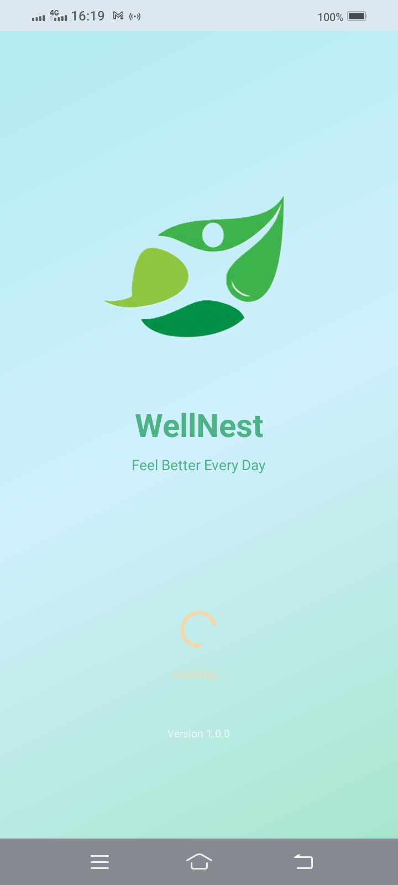
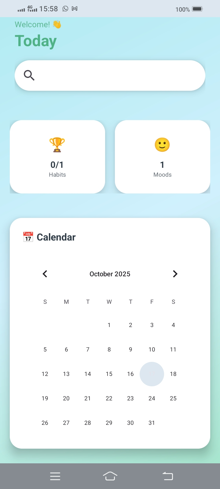
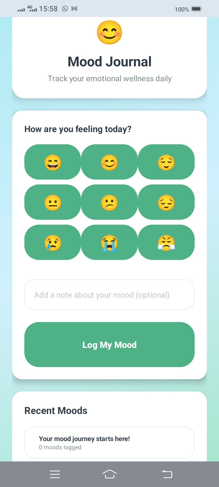
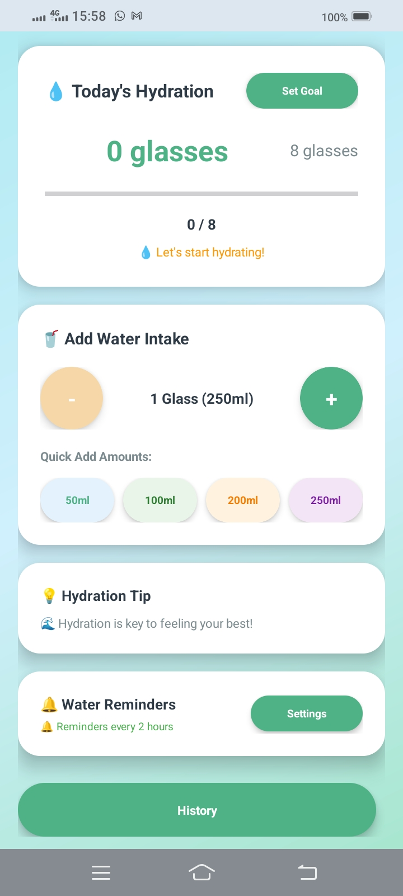
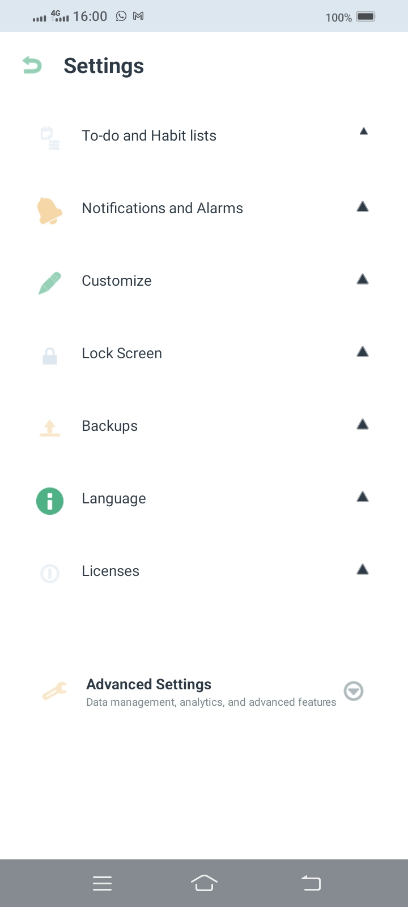
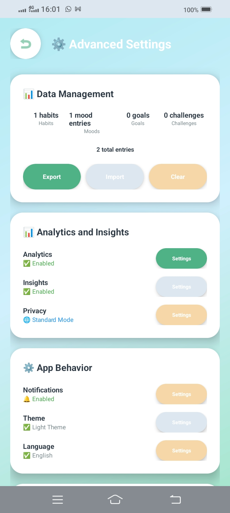

<h1 align="center">🌿 WellNest – Your Personal Wellness Companion</h1>

  <em>Empowering healthy habits, mindfulness, and hydration — all in one calm and beautiful app.</em>

---

## 📱 Overview

**WellNest** is an Android mobile application designed to help users manage and improve their daily health routines effectively.  
The app promotes **physical, mental, and emotional well-being** through a blend of habit tracking, mood journaling, hydration reminders, and wellness insights — all wrapped in a soothing, user-friendly interface.

Built with **Android Studio** and **Kotlin**, WellNest uses **Room ORM with SQLite** to ensure data persistence and long-term tracking of user progress.

---

## ✨ Key Features

### 🗓️ 1. Daily Habit Tracker
- Add, edit, and delete wellness habits such as *Drink Water* or *Meditate*.  
- View progress with checklists or progress bars.  
- All habit data is stored securely in the **Room database** for persistent tracking.

---

### 😊 2. Mood Journal with Emoji Selector
- Record your daily mood using expressive emojis and optional notes.  
- Each entry includes date and time for emotional trend tracking.  
- View past entries anytime thanks to **SQLite data persistence**.

---

### 💧 3. Hydration Reminder System
- Sends periodic reminders to drink water using **AlarmManager** or **WorkManager**.  
- Reminder intervals are customizable and stored for persistence across sessions.  
- Encourages hydration habits for better daily health.

---

### 📊 4. Wellness Progress & Insights
- Displays **weekly and monthly wellness analytics** using charts.  
- Visualize habit completion rates and mood trends.  
- Helps users stay motivated and consistent.

---

### 🎨 5. Calm & Responsive User Interface
- Designed using **Material 3** principles.  
- Soft, pastel gradient palette: *mint green*, *light blue*, *sand beige*.  
- Responsive design for all screen sizes.  
- Minimal, distraction-free environment for mindfulness and focus.

---

### 💾 6. Data Persistence with Room ORM
- Uses **Room ORM with SQLite** for structured and efficient data storage.  
- Handles CRUD operations for habits, moods, and reminders.  
- Ensures data safety, even after app restarts.

---

### ⚙️ 7. Settings & Personalization
- Customize:
  - Notification times  
  - App theme (Light/Dark)  
  - Language (English / Sinhala / Tamil)  
  - Interface style  
- User preferences stored via **Shared Preferences** and **Room**.

---

## 🧭 Tech Stack 

  

---

## 🎨 UI Design Concept

| Design Aspect | Description |
|----------------|-------------|
| **Primary Colors** | Mint Green (#A8E6CF), Light Blue (#D0F0F7), Sand Beige (#F5EBD0) |
| **Theme** | Calm, soothing, and minimalistic |
| **Font** | Google Sans / Roboto |
| **Design System** | Material 3 (Jetpack Compose compatible) |

---

## 📸 Screenshots

  
  
  

  
  
  

---

## 📫 Contact
- **Email:** officiallahiru.p@gmail.com  
- **GitHub:** [lahiru-priyankara](https://github.com/lahiru-priyankara)  

---

  <strong>“Your wellness journey starts here — one habit at a time.”</strong> 🌿💧🧘‍♀️

